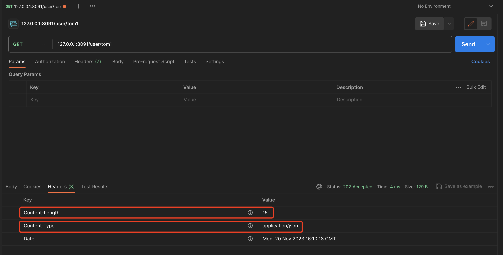

# 09. Context-处理输出

本节课工程结构如下:

```
(base) yanglei@yuanhong 07-respJSON % tree ./
./
├── context.go
├── context_test.go
├── go.mod
├── go.sum
├── handleFunc.go
├── httpServer.go
├── httpServer_test.go
├── matchNode.go
├── node.go
├── router.go
├── router_test.go
├── serverInterface.go
└── stringValue.go

0 directories, 13 files
```

## PART1. JSON响应

### 1.1 基本实现

这个需求还是比较简单的.其实只有2个步骤:

- step1. 调用`json.Marshal()`,拿到JSON反序列化后的字节切片
- step2. 将反序列化后的字节切片写入到响应(`http.ResponseWriter`,实际上是`http.response`)中

```go
package respJSON

import (
	"encoding/json"
	"errors"
	"net/http"
	"net/url"
)

// Context HandleFunc的上下文
type Context struct {
	// Req 请求
	Req *http.Request
	// Resp 响应
	Resp http.ResponseWriter
	// PathParams 路径参数名值对
	PathParams map[string]string
	// QueryValues 查询参数名值对
	queryValues url.Values
}

// RespJSONBase 以JSON格式输出相应
func (c *Context) RespJSONBase(obj any) (err error) {
	data, err := json.Marshal(obj)
	if err != nil {
		return err
	}

	_, err = c.Resp.Write(data)
	return err
}
```

### 1.2 进阶实现

更进一步的,这个方法应该完善的功能点有:

- 设置响应码
- 设置响应头中的`Content-Type`为`application/json`
- 设置响应头中的`Content-Length`为字节切片的长度
- 判断写入响应体的长度和JSON反序列化后的字节切片长度是否相同

```go
package respJSON

import (
	"encoding/json"
	"errors"
	"net/http"
	"net/url"
	"strconv"
)

// Context HandleFunc的上下文
type Context struct {
	// Req 请求
	Req *http.Request
	// Resp 响应
	Resp http.ResponseWriter
	// PathParams 路径参数名值对
	PathParams map[string]string
	// QueryValues 查询参数名值对
	queryValues url.Values
}

// RespJSON 以JSON格式输出相应
func (c *Context) RespJSON(status int, obj any) (err error) {
	data, err := json.Marshal(obj)
	if err != nil {
		return err
	}

	c.Resp.Header().Set("Content-Type", "application/json")
	c.Resp.Header().Set("Content-Length", strconv.Itoa(len(data)))
	// Tips: 在写入响应状态码之前设置响应头 因为一旦调用了WriteHeader方法
	// Tips: 随后对响应头的任何修改都不会生效 因为响应头已经发送给客户端了
	c.Resp.WriteHeader(status)
	
	n, err := c.Resp.Write(data)
	if n != len(data) {
		return errors.New("web绑定错误: 写入响应体不完整")
	}

	return err
}
```

这里需要注意的点是:

**需要在写入响应状态码之前设置响应头**.一旦调用了`http.response.WriteHeader()`方法,随后对响应头的任何修改都不会生效,因为响应头已经发送给客户端了.因此需要先设置好所有的响应头,然后再调用`http.response.WriteHeader()`写入状态码

测试用例`context_test.go`如下:

```go
package respJSON

import (
	"testing"
)

func TestContext_RespJSON(t *testing.T) {
	s := &HTTPServer{router: newRouter()}

	handleFunc := func(ctx *Context) {
		type User struct {
			Name string `json:"name"`
		}

		// 获取路径参数
		id := ctx.PathValue("name")

		user := &User{Name: id.value}

		ctx.RespJSON(202, user)
	}

	s.GET("/user/:name", handleFunc)
	_ = s.Start(":8091")
}
```




### 1.3 基于进阶实现的封装

例如可以封装一个返回HTTP状态码为200的JSON响应

```go
package respJSON

import (
	"encoding/json"
	"errors"
	"net/http"
	"net/url"
	"strconv"
)

// Context HandleFunc的上下文
type Context struct {
	// Req 请求
	Req *http.Request
	// Resp 响应
	Resp http.ResponseWriter
	// PathParams 路径参数名值对
	PathParams map[string]string
	// QueryValues 查询参数名值对
	queryValues url.Values
}

// RespJSONOK 以JSON格式输出一个状态码为200的响应
func (c *Context) RespJSONOK(obj any) (err error) {
	return c.RespJSON(http.StatusOK, obj)
}
```

这里有一个问题:如果`obj`的类型为`string`或者`[]byte`,这种场景下用户该怎么办?

答:在这种场景下,用户已经不需要调用`RespJSON()`方法了,直接操作`http.ResponseWriter`即可

## PART2. 输出Cookie

本部分工程结构如下:

```
(base) yanglei@bogon 08-setCookie % tree ./
./
├── context.go
├── context_test.go
├── go.mod
├── go.sum
├── handleFunc.go
├── httpServer.go
├── httpServer_test.go
├── matchNode.go
├── node.go
├── router.go
├── router_test.go
├── serverInterface.go
└── stringValue.go

0 directories, 13 files
```

### 2.1 功能实现

这个功能实现起来也比较容易:

```go
package setCookie

import (
	"encoding/json"
	"errors"
	"net/http"
	"net/url"
	"strconv"
)

// Context HandleFunc的上下文
type Context struct {
	// Req 请求
	Req *http.Request
	// Resp 响应
	Resp http.ResponseWriter
	// PathParams 路径参数名值对
	PathParams map[string]string
	// QueryValues 查询参数名值对
	queryValues url.Values
}

// SetCookie 设置响应头中的Set-Cookie字段
func (c *Context) SetCookie(cookie *http.Cookie) {
	http.SetCookie(c.Resp, cookie)
}
```

在早期的GO中,是没有`http.SetCookie()`函数的.但实际上[`http.SetCookie()`](https://github.com/golang/go/blob/master/src/net/http/cookie.go#L169)函数的实现也是拼接一个`Set-Cookie`的响应头字段到响应头中.因此早期的GO WEB框架帮助框架使用者拼接了这个`Set-Cookie`字段.拼接的过程实际上就相当于实现[`http.Cookie.String()`](https://github.com/golang/go/blob/master/src/net/http/cookie.go#L179)方法.

### 2.2 问题1:是否应该在Context上提供一些关于cookie的默认配置?

例如配置同源策略:

```go
package setCookie

import (
	"encoding/json"
	"errors"
	"net/http"
	"net/url"
	"strconv"
)

// Context HandleFunc的上下文
type Context struct {
	// Req 请求
	Req *http.Request
	// Resp 响应
	Resp http.ResponseWriter
	// PathParams 路径参数名值对
	PathParams map[string]string
	// QueryValues 查询参数名值对
	queryValues url.Values
	// cookieSameSite cookie的SameSite属性 即同源策略
	cookieSameSite http.SameSite
}

// SetCookieWithOption 设置响应头中的Set-Cookie字段 并将Context中关于
// cookie的配置应用到给定的cookie上
func (c *Context) SetCookieWithOption(cookie *http.Cookie) {
	cookie.SameSite = c.cookieSameSite
	http.SetCookie(c.Resp, cookie)
}
```

**不推荐这种做法.因为关于cookie的选项属性不需要挂在Context上.使用者创建cookie自行设置,设置好后调用`Context.SetCookie()`方法即可**.

## PART3. 支持错误页面

本节工程结构如下:

```
(base) yanglei@bogon 09-errPage % tree ./
./
├── context.go
├── context_test.go
├── go.mod
├── go.sum
├── handleFunc.go
├── httpServer.go
├── httpServer_test.go
├── matchNode.go
├── node.go
├── router.go
├── router_test.go
├── serverInterface.go
└── stringValue.go

0 directories, 13 files
```

我们通常有一个需求:如果一个响应返回了404,那么应该重定向到一个默认页面,比如说重定向到首页.该怎么处理这个需求?

这个需求棘手的点在于:**不是所有的404响应都是要重定向的**.比如异步加载数据的RESTful请求.假设需求为在打开页面之后异步请求用户详情接口,那么这个场景下,即使响应404了,也不应该再重定向了.

我们现在的实现如下:

```go
package setCookie

import (
	"net"
	"net/http"
)

// 为确保HTTPServer结构体为Server接口的实现而定义的变量
var _ Server = &HTTPServer{}

// HTTPServer HTTP服务器
type HTTPServer struct {
	router
}

// serve 查找路由树并执行命中的业务逻辑
func (s *HTTPServer) serve(ctx *Context) {
	method := ctx.Req.Method
	path := ctx.Req.URL.Path
	targetNode, ok := s.findRoute(method, path)
	// 没有在路由树中找到对应的路由节点 或 找到了路由节点的处理函数为空(即NPE:none pointer exception 的问题)
	// 则返回404
	if !ok || targetNode.node.HandleFunc == nil {
		ctx.Resp.WriteHeader(http.StatusNotFound)
		// 此处确实会报错 但是作为一个WEB框架 遇上了这种错误也没有特别好的处理办法
		// 最多只能是落个日志
		_, _ = ctx.Resp.Write([]byte("Not Found"))
		return
	}

	// 命中节点则将路径参数名值对设置到上下文中
	ctx.PathParams = targetNode.pathParams

	// 执行路由节点的处理函数
	targetNode.node.HandleFunc(ctx)
}
```

我们现在只是返回了一个"Not Found"的字符串,通常而言应该是重定向到一个用于"兜底"的错误页面.

WEB框架确实应该支持这种重定向到错误页面的功能,但这个功能不应该在Context这个抽象层级上支持.因为即使在Context这个抽象层级上支持了这个功能,使用者用起来也非常麻烦,因为使用者每次需要重定向到错误页面时,都需要自己调用

实现:

```go
package errPage

import (
	"encoding/json"
	"errors"
	"net/http"
	"net/url"
	"strconv"
)

// Context HandleFunc的上下文
type Context struct {
	// Req 请求
	Req *http.Request
	// Resp 响应
	Resp http.ResponseWriter
	// PathParams 路径参数名值对
	PathParams map[string]string
	// QueryValues 查询参数名值对
	queryValues url.Values
	// cookieSameSite cookie的SameSite属性 即同源策略
	cookieSameSite http.SameSite
}

// ErrPage 指定重定向到错误页面
func (c *Context) ErrPage() {
	// Tips: 此处用"this is a error page"模拟一个错误页面
	c.Resp.Write([]byte("this is a error page"))
}
```

很明显使用者需要自己调用这个`Context.ErrPage()`方法,才能返回错误页面.

那么如果在框架内部检测状态码,并确认是否需要重定向到错误页面,是否可行?

这里我们以`Context.RespJSON()`方法举例:

```go
package errPage

import (
	"encoding/json"
	"errors"
	"net/http"
	"net/url"
	"strconv"
)

// Context HandleFunc的上下文
type Context struct {
	// Req 请求
	Req *http.Request
	// Resp 响应
	Resp http.ResponseWriter
	// PathParams 路径参数名值对
	PathParams map[string]string
	// QueryValues 查询参数名值对
	queryValues url.Values
	// cookieSameSite cookie的SameSite属性 即同源策略
	cookieSameSite http.SameSite
}

// ErrPage 指定重定向到错误页面
func (c *Context) ErrPage() {
	// Tips: 此处用"this is a error page"模拟一个错误页面
	c.Resp.Write([]byte("this is a error page"))
}

// RespJSON 以JSON格式输出相应
func (c *Context) RespJSON(status int, obj any) (err error) {
	// 如果响应状态码为404 则重定向到错误页面
	if status == http.StatusNotFound {
		c.ErrPage()
		return nil
	}

	data, err := json.Marshal(obj)
	if err != nil {
		return err
	}

	c.Resp.Header().Set("Content-Type", "application/json")
	c.Resp.Header().Set("Content-Length", strconv.Itoa(len(data)))
	// Tips: 在写入响应状态码之前设置响应头 因为一旦调用了WriteHeader方法
	// Tips: 随后对响应头的任何修改都不会生效 因为响应头已经发送给客户端了
	c.Resp.WriteHeader(status)

	n, err := c.Resp.Write(data)
	if n != len(data) {
		return errors.New("web绑定错误: 写入响应体不完整")
	}

	return err
}
```

这里我们检测到响应码为404时,自动重定向到错误页面,也不可行.因为**不是所有的404响应都是要重定向的**.

在后续的AOP中,我们再来设计这个需求的解决方案
