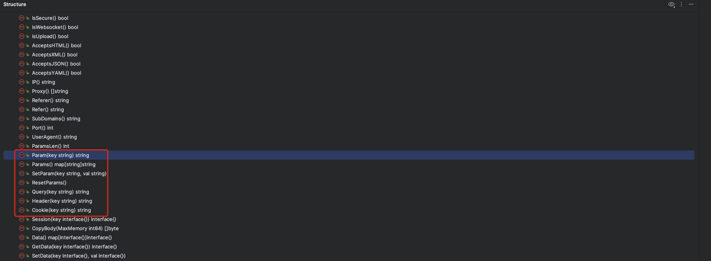
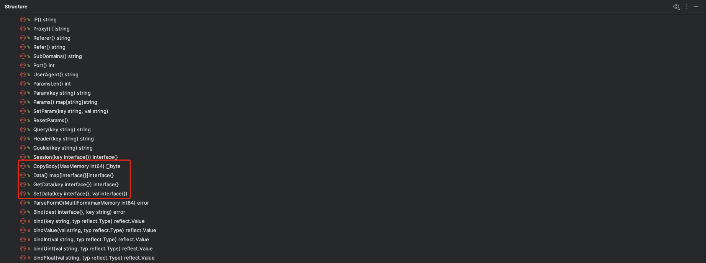

# 2. Context-Beego Context设计分析

## PART1. Beego Context设计

### 1.1 `Context`

在之前的课程中说过,Beego的[Context](https://github.com/beego/beego/blob/develop/server/web/context/context.go#L72)中,既有`Input`又有`Request`;既有`Output`又有`ResponseWriter`.很明显功能上是重叠的,道理上来讲,`Input`和`Request`留一个即可;`Output`和`ResponseWriter`留一个即可;或者将`Request`放到`Input`中,将`ResponseWriter`放到`Output`中.

```go
type Context struct {
	Input          *BeegoInput
	Output         *BeegoOutput
	Request        *http.Request
	ResponseWriter *Response
	_xsrfToken     string
}
```

这样的设计,对于使用者而言,很难理解`Input`和`Request`、`Output`和`ResponseWriter`之间的区别和各自的使用场景.

其中:

- `Input`:对输入的封装
- `Output`:对输出的封装
- `ResponseWriter`:对响应的封装

### 1.2 `BeegoInput`

[BeegoInput](https://github.com/beego/beego/blob/develop/server/web/context/input.go#L46)是对输入的封装

```go
type BeegoInput struct {
	Context       *Context
	CruSession    session.Store
	pnames        []string
	pvalues       []string
	data          map[interface{}]interface{}
	dataLock      sync.RWMutex
	RequestBody   []byte
	RunMethod     string
	RunController reflect.Type
}
```

- `BeegoInput.Context`:反向引用了`Context`.而`Context`中也通过`Input`字段引用了`BeegoInput`,这种A引用B同时B引用A的场景在GO中是比较常见的设计
- `BeegoInput.CruSession`:耦合了Session
- `BeegoInput.pnames`:记录了参数路径的参数名
- `BeegoInput.pvalues`:记录了参数路径的参数值
- `BeegoInput.data`:记录了输入的数据(具体是啥我也不知道,没用过这个框架)
- `BeegoInput.RequestBody`:若将[`web.Config.CopyRequestBody`](https://github.com/beego/beego/blob/develop/server/web/config.go#L73)设置为true,则框架会将原生的`http.Request.Body`中的内容读到这个字段上

### 1.3 `BeegoOutput`

[BeegoOutput](https://github.com/beego/beego/blob/develop/server/web/context/output.go#L39)是对输出的封装

```go
// BeegoOutput does work for sending response header.
type BeegoOutput struct {
	Context    *Context
	Status     int
	EnableGzip bool
}
```

- `BeegoOutput.Context`:同样反向引用了`Context`
- `BeegoOutput.Status`:HTTP响应码
- `BeegoOutput.EnableGzip`:在写Response时是否启用Gzip压缩

### 1.4 `Response`

[`Response`](https://github.com/beego/beego/blob/develop/server/web/context/context.go#L334)

```go
type Response struct {
	http.ResponseWriter
	Started bool
	Status  int
	Elapsed time.Duration
}
```

- 组合了原生的`http.ResponseWriter`
- `Response.Started`:若该字段为true,则表示当前`Response`结构体实例已经被写入过了

## PART2. Beego 处理输入的方法

### 2.1 负责处理来自`http.Request.Body`输入的方法

#### 2.1.1 `Context`的Bind族方法


`Context`中的`Bind`族方法,用于将不同形式的`Body`转化为具体的结构体.

#### 2.1.2 `Input`的`Bind()`方法

[`Input.Bind()`](https://github.com/beego/beego/blob/develop/server/web/context/input.go#L443)方法用于将输入的一部分(通过`key`参数指定)绑定到给定的`dest`上(这个`dest`可能是变量/map/结构体等).

### 2.2 负责处理来自其他部位的方法



这些方法负责从`http.Request`的其他部位(例如Header、查询参数等)上获取输入



这里的`GetData()`中的data指的是其他Beego内部的其他组件或Middleware向`BeegoInput.data`中写入的数据

### 2.3 各种判断的方法


实际上这一类方法完全没必要提供,完全可以让用户自己判断,例如`if method == http.MethodGet`的方式去判断.

## PART3. Beego 处理输出的方法

### 3.1 将输入序列化之后输出的方法


这一类方法(Resp族的方法)将入参`data`转化成对应的格式,然后输出到响应中

### 3.2 渲染模板输出的方法


这一类方法是在`web.Controller`结构体上的,用于渲染页面并输出

### 3.3 输出各种格式数据的方法


这一类方法是在`context.BeegoOutput`结构体上的,实际上3.1小节中的Resp族的方法,最终调用的是`BeegoOutput`上对应数据格式的方法.

而且,`context.BeegoOutput`还有一些直接输出Body(`Body()`方法)和Header(`Header()`方法)的方法.

也就是说,写响应时,可以使用`Context`,也可以使用`Context.BeegoOutput`,看自己喜好即可.当然,这也会导致框架的使用者会有不同的风格来控制输出.