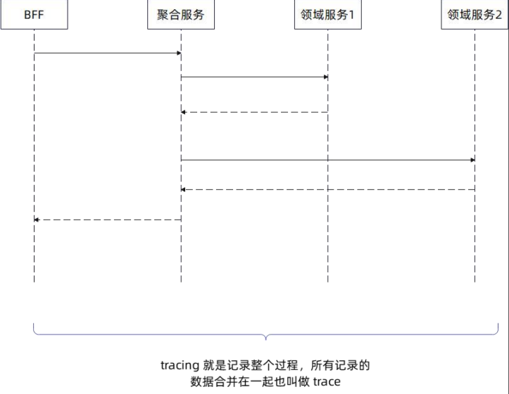
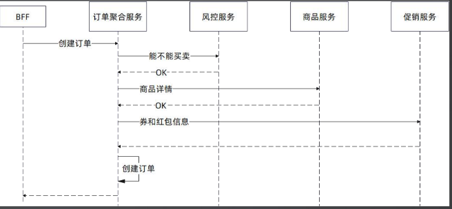
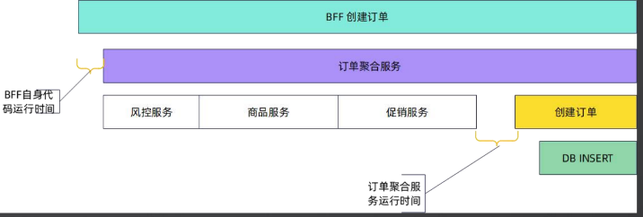
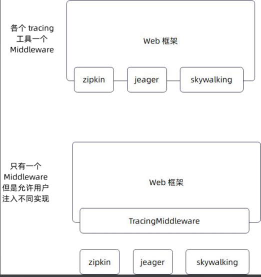
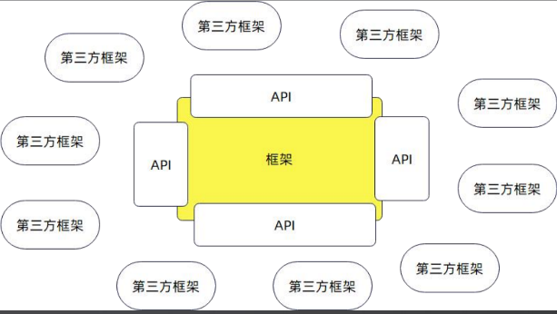
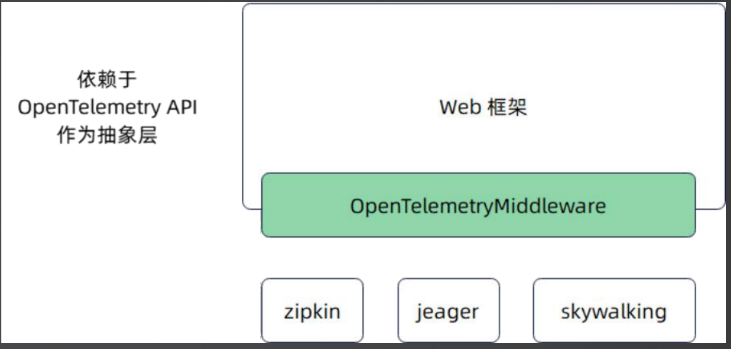
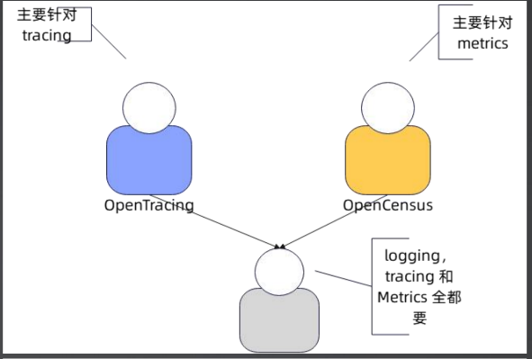
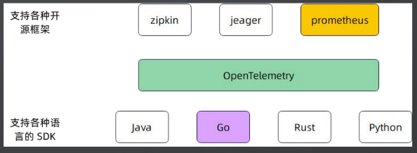
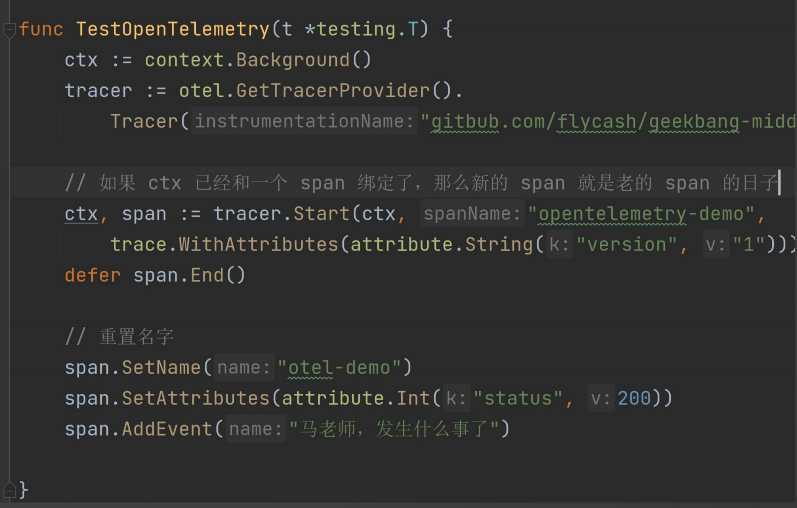

# 02.Middleware-Trace简介和OpenTelemetry

## PART1. Trace简介

Tracing:踪迹.它记录了从收到请求到返回响应的整个过程.在分布式环境下,**一般代表着请求从Web收到,沿着后续微服务链条传递,得到响应再返回前端的过程**.




如图所示,这里说的"请求从Web收到",是指BFF层收到.

BFF层:Backend For Frontend层,针对聚合服务的一层,用于为前端页面拼凑来自各个领域服务的数据

在BFF层之前的过程(比如Nginx网关),不会被记录在Tracing中.

通常状况下,BFF层调用聚合服务层,聚合服务调用(多个)领域服务.包括被聚合服务调用到的领域服务,其本身也会调用其他领域服务.

普适的调用链如下:

BFF --调用--> 聚合服务 --调用--> 领域服务1 --调用--> 领域服务2

BFF <--响应-- 聚合服务 <--响应-- 领域服务1 <--响应-- 领域服务2

经过这个完整的调用链后,即可得到一个记录了完整调用过程的trace

### 1.1 链路追踪



- step1. BFF层收到请求,调用订单聚合服务
- step2. 订单聚合服务调用风控服务.这里的调用取决于公司的技术选型,有可能是RPC调用,也有可能是HTTP调用
- step3. 风控服务响应订单聚合服务:当笔订单能否继续进行
	- 一般真实的创建订单的过程,非常复杂.以风控服务为例,会判断很多因素:
		- 商家是否为正常商家(商家有无洗钱嫌疑);
		- 订单中的商品是否为正常的商品
		- 买家是否为一个正常的买家(是否存在刷单嫌疑);
- step4. 订单聚合服务调用商品服务
- step5. 商品服务返回商品的定价、商品的库存等商品关键信息
- step6. 订单聚合服务调用促销服务,获取当笔订单可用的优惠券、红包等折扣信息
- step7. 促销服务返回可用的优惠券、红包
- step8. 订单聚合服务计算订单金额(这里的金额包括很多金额:优惠前金额、优惠后金额、实付金额等各种金额)
	- 有些大厂在这个步骤上的实现非常复杂,比如根据价格引擎中配置的计价规则(这个规则是运营人员配置的,很复杂)计算各种商品的价格,最终求出订单的金额
- step9. 订单聚合服务创建订单
	- 这个步骤也很复杂,涉及到扣除库存等细节问题的处理

需要注意的是,trace中不仅包含服务调用信息,而是包含整条链路上的信息,共包括:

- RPC调用
- HTTP调用
- 数据库查询
- 发送消息(例如发送消息至MQ)
- 业务步骤(例如上述步骤的step8)

这些步骤,也可以进一步被细分,分成更加细的span



注意:图中绿色的`BFF创建订单`和紫色的`订单聚合服务`都叫做span

长方形的宽表示耗时,宽的值越大则表示耗时越长.

需要注意的是,并不一定能在BFF的span内看到所有的调用信息.因为有一些敏感信息(比如图中的风控服务)可能不希望被看到,那么可以设置在风控服务的span内,将一些步骤的链路追踪设置为不可见.

这样一来,在BFF的span内就只能看到风控服务span的总体情况,而看不到内部的细节.

### 1.2 相关概念

- tracer:表示记录trace(踪迹)的实例,一般来说,tracer会有一个对应的接口.可以理解为Factory或Builder的概念,用于构造trace
- span:代表trace中的一段.因此trace本身也可以看做是一个span.span本身是一个层级概念,因此有父子关系.**一个trace的span可以看做是多叉树**

可以看到上图中存在2处空隙.空隙表示的是代码运行的耗时.**如果一个空隙很宽的话,那么说明打点不够详细.需要再在代码中打入一些追踪点**

### 1.3 tracing工具

目前在业界里面,tracing工具还处于百花齐放阶段,有很多开源实现.例如:SkyWalking、Zipkin、Jeager等

#### 1.3.1 第1个问题:需不需要同时支持多种tracing工具?

这个问题的本质是:我们设计的框架,其使用者是谁?

- 给公司内部使用:那么就做成仅支持公司使用的、特定的tracing工具即可.例如公司用zipkin,那就支持zipkin就行了;甚至公司有自研的tracing工具,那么就支持这个自研的tracing工具即可
- 设计开源框架:开源框架的使用者,那就是使用任何tracing工具都有可能了.因此需要支持主流的tracing工具

那么问题来了,该怎么支持这些开源工具?

#### 1.3.2 第2个问题:怎么支持这些开源工具?



总体的思路其实就是两种:

1. 为每个tracing工具写一个Middleware(如上图的上半部分)

	这个思路的缺点在于:
	
	1. 每个中间件都会和对应的tracing工具强耦合
	2. 框架会对这些具体的tracing工具产生依赖关系


2. 定义一个统一的API,框架只和这个API交互.这个API允许用户注入自己的tracing工具的实现(如下图的上半部分)

很明显后一种思路是抽象层级更高、更通用的解决方案.因此我们采用这种思路来设计我们框架中的Tracing部分

### 1.4 自定义API

一般来讲,如果一个中间件设计者想要摆脱对任何第三方的依赖,都需要采用**定义自己的API**的方式来达到这个目的,常见的有:

- 定义Log API
- 定义Config API
- 定义Tracing API
- 定义Metrics API

#### 1.4.1 为什么我们没有设计设计Log API和Config API?

那么问题来了:我们在设计框架的时候,并没有设计Log API和Config API啊?

这里以`HTTPServer.Start()`方法和`NewHTTPServer()`函数举例说明.

来看我们的`HTTPServer.Start()`方法的方法签名:

```go
func (s *HTTPServer) Start(addr string) error
```

调用`HTTPServer.Start()`方法时,我们作为框架的设计者,**要求用户把参数传进来**.至于这个参数是用户通过何种途径得到的,框架的设计者并不关心.

至于这个参数到底是怎么来的,那可能性就太多了:

- 从配置文件中读取的
- 从环境变量中读取的
- 从程序启动时的参数中读取的

我们作为框架的设计者,如果要去管"参数怎么来的"这件事,那根本是管不完的,而且管这个事儿的意义和含金量都不大.

不如提供一个**编程接口**,像`HTTPServer.Start()`方法那样设计:框架的设计者不关心使用者的参数从何种途径获得,只关心用户传到方法中的参数值即可.

和这种思路相反的思路是**耦合式开发**.我们以"创建`HTTPServer`实例"这个功能为例来说明:

```go
// NewHTTPServerWithConfig 从给定的配置文件中读取配置项 根据配置项创建HTTP服务器
func NewHTTPServerWithConfig(configFilePath string) *HTTPServer {
	// 在函数体内读取配置文件 解析为一个配置对象
	// 然后根据配置对象创建 HTTPServer 实例
	return nil
}
```

按照这种设计形态,则必然需要设计一个`Config`结构体.

如果采取这种设计思想,面临的问题会很多,这里列举几个:

1. 参数`configFilePath`,是相对路径还是绝对路径?
	- 如果是相对路径,是相对于哪个路径的路径?
		- 让使用者传递相对路径,是比较容易出错的.因为使用者很有可能不知道这个函数中定义的相对路径,相对的是哪个路径.可能有人会直觉性地认为相对的是工程根目录,但在稍微复杂一些的运维环境中,研发人员真的未必知道工程根目录的路径是什么

2. 配置文件格式问题
	
	- 由于需要读取不同格式(json/yaml/toml/xml/envfile)的配置文件,因此不可避免地会引入类似[viper](https://github.com/spf13/viper)这种第三方库,这就对第三方产生了依赖
	- 也是因为配置文件格式的多样性,框架的设计者还需要实现针对不同格式的序列化与反序列化.这也是一个复杂且恶心的过程

但实际上设计者直接把这个权利交给用户就好了,根本没必要去实现这些**父母式编程**的功能.只实现**编程接口**就可以了

#### 1.4.2 如何摆脱第三方依赖?



如上图示,想要彻底摆脱第三方依赖,那就得定义出自己的API.换言之就是我们设计的框架核心是稳定的、不直接依赖于第三方库的.使用者在初始化框架的过程中,将API对应的实现通过框架暴露给外部的接口注入进来即可.

##### a. 自定义API的优点

这种设计的好处就在于**框架的内核稳定**,任何第三方库的变更都不会影响到框架

##### b. 自定义API的缺点

- 过度设计:有些场景下即使定义了API,也只会有1个默认实现(比如[`echo.Context`接口](https://github.com/labstack/echo/blob/584cb85a6b749846ac26a8cd151244ab281f2abc/context.go#L19),它仅有1个实现[`echo.context`](https://github.com/labstack/echo/blob/584cb85a6b749846ac26a8cd151244ab281f2abc/context.go#L200))
- API设计的并不怎么样
	- 当然,这并不是自定义API这种设计形态的缺点,而是写代码的人(就是我自己)自身的缺点.

评判一个API设计的好不好,大体上从以下几个方面就能看出来:

1. 易用性:

	框架的使用者通过我定义的API接入一个实现,接入的过程是否容易?
	
2. 扩展性:

	你设计的API不可能不发生任何的变更,随着第三方库的功能扩展或其他原因,你设计的用于接入第三方的API,迟早会有需要变更的一天.当变更来到时,你当初的设计能否让变更对第三方库的影响降到最低?
	
	TODO:我对这句话没概念
	
**忠告:如果你设计不好这种API,那就不要采用自定义API的设计方案**!

在公司可以这么干,因为干完了能拿来吹牛逼;搞开源不能这么搞,因为大概率你这么搞完了事儿就搞砸了,你真就成个睾丸了.

### 1.5 采用OpenTelemetry API



如上图示,最终我们决定依赖OpenTelemetry API来完成各种链路追踪中间件的接入.理由很简单:**我们定义的API肯定不如OpenTelemetry API**.因此采用OpenTelemetry API作为抽象层.

图中的OpenTelemetryMiddleware,实际上就是1.3.2小节图中的TracingMiddleware.然后就可以注入OpenTelemetryMiddleware的不同实现了

那么问题来了,OpenTelemetry是啥?

## PART2. OpenTelemetry简介

[OpenTelemetry](https://opentelemetry.io/)是OpenTracing和OpenCensus合并而来



- OpenTelemetry同时支持了**logging、tracing和metrics**
- OpenTelemetry**提供了各种语言的SDK**
- OpenTelemetry**适配了各种开源链路追踪中间件**,如Zipkin、Jeager、Prometheus



总而言之言而总之,OpenTelemetry是新时代的可观测性平台

### 2.1 OpenTelemetry GO SDK入门

[文档地址](https://opentelemetry.io/docs/instrumentation/go/)



注:这个图中的代码我也没写过,就是理解一下图中每个API的含义

#### 2.1.1 TracerProvider

TracerProvider:**用于构造tracer实例**.Provider在平时开发中也很常见,有时可以看作是轻量级的工厂模式或轻量级的生成器模式.

通常Provider会提供一些缓存机制.比如图中的`otel.GetTracerProvider()`这行代码,调用过这个API之后,后续如果再调用`otel.GetTracerProvider()`,你拿到的TracerProvider和之前调用`otel.GetTracerProvider()`拿到的TracerProvider是同一个TracerProvider

#### 2.1.2 tracer

tracer:追踪者,用于构造trace

构造tracer需要一个`instrumentationName`,一般来说就是你构造tracer的地方的包名(保证唯一即可).例如图中的`Tracer("gitbub.com/flycash/geekbang-middleware")`.这里的`"gitbub.com/flycash/geekbang-middleware"`就是`instrumentationName`

#### 2.1.3 span

span:调用tracer上的`Start()`方法.如果传入的context里面已经有一个span了,那么新创建的span就是老的span的儿子.span要记住调用`End()`方法

图中的

```go
ctx，span := tracer.Start(ctx, "opentelemetry-demo", 
	trace.WithAttributes(attribute.String("version"，"1")))
```

即为调用了tracer上的`Start()`方法.

这里需要注意的是,如果调用`tracer.Start()`方法时传入的context(我们将这个context命名为contextA)已经和一个span(我们将这个span命名为spanB)绑定过的话,则使用contextA调用`tracer.Start()`方法时返回的span(我们将这个span命名为spanB)是spanA的儿子,二者构成层级关系

图中的`span.End()`,其含义为结束这个span,标志着这个span的生命周期结束

### 2.2 OpenTelemetry与Zipkin和Jeager的结合


上图为向OpenTelemetry注入Zipkin的实现;

下图为向OpenTelemetry注入Jeager的实现;

具体的代码都不用记,重点是看这两段代码的相似性:

- 都是先构建各自的exporter
- 然后再将这个exporter转换成对应的TraceProvider
- 最后调用`otel.SetTracerProvider()`方法,将TraceProvider注入到OpenTelemetry中

可以把这个注入的过程理解为一个适配器模式:各种exporter要去适配TraceProvider.

至于具体怎么创建exporter,这个完全可以抄代码.不用记,就抄图中的代码即可

## PART3. OpenTelemetry Middleware

### 3.1 Builder模式

本节课工程结构如下:

```
(base) yanglei@yuanhong 02-tracing % tree ./
./
├── context.go
├── context_test.go
├── go.mod
├── go.sum
├── handleFunc.go
├── httpServer.go
├── httpServer_test.go
├── matchNode.go
├── middleware.go
├── middleware_test.go
├── middlewares
│   └── access_log
│       ├── accessLog.go
│       ├── accessLog_test.go
│       └── middlewareBuilder.go
├── node.go
├── option.go
├── router.go
├── router_test.go
├── safeContext.go
├── serverInterface.go
└── stringValue.go

2 directories, 20 files
```

和写accessLog时一样,也是先定义出Builder模式的基本结构:

`middlewares/open_telemetry/middlewareBuilder.go`:

```go
package open_telemetry

import (
	"web"
)

// MiddlewareBuilder openTelemetry中间件构建器
type MiddlewareBuilder struct {
}

// Build 构建中间件
func (m *MiddlewareBuilder) Build() web.Middleware {
	return func(next web.HandleFunc) web.HandleFunc {
		return func(ctx *web.Context) {
			next(ctx)
		}
	}
}
```

### 3.2 初始化Tracer

#### 3.2.1 将Tracer设置为一个公有字段的方案

`middlewares/open_telemetry/middlewareBuilder.go`:

```go
package open_telemetry

import (
	"go.opentelemetry.io/otel"
	"go.opentelemetry.io/otel/trace"
	"web"
)

// instrumentationName 仪表盘名称 通常以包名作为仪表盘名称
// TODO: 如果真的把这个框架 作为一个独立的库发布 这里要改成github.com/xxx/xxx这样的形式
const instrumentationName = "web/middlewares/open_telemetry"

// MiddlewareBuilder openTelemetry中间件构建器
type MiddlewareBuilder struct {
	Tracer trace.Tracer // Tracer 追踪器
}

// Build 构建中间件
func (m *MiddlewareBuilder) Build() web.Middleware {
	return func(next web.HandleFunc) web.HandleFunc {
		if m.Tracer == nil {
			m.Tracer = otel.GetTracerProvider().Tracer(instrumentationName)
		}

		return func(ctx *web.Context) {
			next(ctx)
		}
	}
}
```

#### 3.2.2 将Tracer设置为一个私有字段的方案

`middlewares/open_telemetry/middlewareBuilder.go`:

```go
package open_telemetry

import (
	"go.opentelemetry.io/otel/trace"
)

// MiddlewareBuilder openTelemetry中间件构建器
type MiddlewareBuilder struct {
	tracer trace.Tracer // tracer 追踪器
}

// NewMiddlewareBuilder 创建中间件构建器
func NewMiddlewareBuilder(tracer trace.Tracer) *MiddlewareBuilder {
	return &MiddlewareBuilder{
		tracer: tracer,
	}
}
```

也可以将这个字段的属性设置为私有,在实例化`MiddlewareBuilder`时要求框架使用者必须传入一个`trace.Tracer`

我们在这里采用公有字段的方案.因为通常情况下框架的使用者会创建一个全局的Tracer,所以就没必要再让他们把一个创建好的实例传到`open_telemetry`包里来了

### 3.3 创建span并记录数据

#### 3.3.1 创建span并修改span的名称

`middlewares/open_telemetry/middlewareBuilder.go`:

```go
package open_telemetry

import (
	"go.opentelemetry.io/otel"
	"go.opentelemetry.io/otel/trace"
	"web"
)

// instrumentationName 仪表盘名称 通常以包名作为仪表盘名称
// TODO: 如果真的把这个框架 作为一个独立的库发布 这里要改成github.com/xxx/xxx这样的形式
const instrumentationName = "web/middlewares/open_telemetry"

// MiddlewareBuilder openTelemetry中间件构建器
type MiddlewareBuilder struct {
	Tracer trace.Tracer // Tracer 追踪器
}

// Build 构建中间件
func (m *MiddlewareBuilder) Build() web.Middleware {
	return func(next web.HandleFunc) web.HandleFunc {
		if m.Tracer == nil {
			m.Tracer = otel.GetTracerProvider().Tracer(instrumentationName)
		}

		return func(ctx *web.Context) {
			// step1. 创建span
			// 1. Tracer.Start()方法的第1个参数是一个 context.Context 接口的实现
			// 而我们的 web.Context 并没有实现 context.Context 接口 (其实在这里拿到的是 context.Background() )
			// 2. Tracer.Start()方法的第2个参数是一个 span 的名称 通常以请求命中的路由作为 span 的名称
			// 但此时还不知道这个请求是否能命中路由 所以使用 "unknown" 作为 span 的名称
			reqCtx, span := m.Tracer.Start(ctx.Req.Context(), "unknown")
			// 4. 调用完成后要关闭span
			defer span.End()

			next(ctx)
			// 3. 只有当请求命中路由(实际上在这里已经执行完了对应的 web.HandleFunc 了)后
			// 才能确定请求命中的路由 因此在执行完 HandleFunc 后 再把span的名称改成请求命中的路由
			if ctx.MatchRoute != "" {
				span.SetName(ctx.MatchRoute)
			}
		}
	}
}
```

这里有3个需要注意的地方:

1. `Tracer.Start()`方法接收的第1个参数是`context.Context`接口的实现,而非是我们自己设计的`web.Context`.因此需要拿请求的上下文作为此处的参数
2. `Tracer.Start()`方法接收的第2个参数是一个span的名称,通常以请求命中的路由作为span的名称.可是在创建span时,还不确定当前的请求能否命中路由,所以先用`unknown`替代
3. 当请求命中了路由,并执行完对应的HandleFunc后,就能够确定命中的路由了.这时要将span的名称修改为请求命中的路由.这里需要注意的是,如果没有找到命中的路由,说明就404了,这种情况下同样不需要修改span的名称.换言之,仅在确定命中了路由时,才需要修改span的名称
4. 调用完成后要关闭span

#### 3.3.2 记录数据

`middlewares/open_telemetry/middlewareBuilder.go`:

```go
package open_telemetry

import (
	"go.opentelemetry.io/otel"
	"go.opentelemetry.io/otel/attribute"
	"go.opentelemetry.io/otel/trace"
	"web"
)

// instrumentationName 仪表盘名称 通常以包名作为仪表盘名称
// TODO: 如果真的把这个框架 作为一个独立的库发布 这里要改成github.com/xxx/xxx这样的形式
const instrumentationName = "web/middlewares/open_telemetry"

// MiddlewareBuilder openTelemetry中间件构建器
type MiddlewareBuilder struct {
	Tracer trace.Tracer // Tracer 追踪器
}

// Build 构建中间件
func (m *MiddlewareBuilder) Build() web.Middleware {
	return func(next web.HandleFunc) web.HandleFunc {
		if m.Tracer == nil {
			m.Tracer = otel.GetTracerProvider().Tracer(instrumentationName)
		}

		return func(ctx *web.Context) {
			// step1. 创建span
			// 1. Tracer.Start()方法的第1个参数是一个 context.Context 接口的实现
			// 而我们的 web.Context 并没有实现 context.Context 接口 (其实在这里拿到的是 context.Background() )
			// 2. Tracer.Start()方法的第2个参数是一个 span 的名称 通常以请求命中的路由作为 span 的名称
			// 但此时还不知道这个请求是否能命中路由 所以使用 "unknown" 作为 span 的名称
			_, span := m.Tracer.Start(ctx.Req.Context(), "unknown")
			// 4. 调用完成后要关闭span
			defer span.End()

			// step2. 设置span的标签(就是记录数据)
			attributes := []attribute.KeyValue{
				// 请求的HTTP动词
				attribute.String("http.method", ctx.Req.Method),
				// 请求的url
				attribute.String("http.url", ctx.Req.URL.String()),
				// 请求的scheme (http/https)
				attribute.String("http.scheme", ctx.Req.URL.Scheme),
				// 请求的host
				attribute.String("http.host", ctx.Req.URL.Host),
			}
			span.SetAttributes(attributes...)

			next(ctx)

			// 3. 只有当请求命中路由(实际上在这里已经执行完了对应的 web.HandleFunc 了)后
			// 才能确定请求命中的路由 因此在执行完 HandleFunc 后 再把span的名称改成请求命中的路由
			if ctx.MatchRoute != "" {
				span.SetName(ctx.MatchRoute)
			}
		}
	}
}
```

#### 3.3.3 与上下游结合

截至目前我们的实现都是有一个边界的:仅在进程内记录了span.那么问题来了:如果现在的场景是跨进程通信的,且我们的客户端也有其自己的span,该如何把我们创建的span和客户端的span结合在一起?

`middlewares/open_telemetry/middlewareBuilder.go`:

```go
package open_telemetry

import (
	"go.opentelemetry.io/otel"
	"go.opentelemetry.io/otel/attribute"
	"go.opentelemetry.io/otel/propagation"
	"go.opentelemetry.io/otel/trace"
	"web"
)

// instrumentationName 仪表盘名称 通常以包名作为仪表盘名称
// TODO: 如果真的把这个框架 作为一个独立的库发布 这里要改成github.com/xxx/xxx这样的形式
const instrumentationName = "web/middlewares/open_telemetry"

// MiddlewareBuilder openTelemetry中间件构建器
type MiddlewareBuilder struct {
	Tracer trace.Tracer // Tracer 追踪器
}

// Build 构建中间件
func (m *MiddlewareBuilder) Build() web.Middleware {
	return func(next web.HandleFunc) web.HandleFunc {
		if m.Tracer == nil {
			m.Tracer = otel.GetTracerProvider().Tracer(instrumentationName)
		}

		return func(ctx *web.Context) {
			// step3. 尝试与客户端的span建立父子关系
			// 1. 从请求头中获取traceId和spanId (客户端的traceId和spanId是放在HTTP请求头中的)
			reqCtx := ctx.Req.Context()
			// Tips: 其实这个HeaderCarrier就是一个map[string][]string 跟request.Header是一样的
			carrier := propagation.HeaderCarrier(ctx.Req.Header)
			// 2. 基于客户端的traceId和spanId 重新封装成context.Context
			reqCtx = otel.GetTextMapPropagator().Extract(reqCtx, carrier)

			// step1. 创建span
			// 1. Tracer.Start()方法的第1个参数是一个 context.Context 接口的实现
			// 而我们的 web.Context 并没有实现 context.Context 接口 (其实在这里拿到的是 context.Background() )
			// 2. Tracer.Start()方法的第2个参数是一个 span 的名称 通常以请求命中的路由作为 span 的名称
			// 但此时还不知道这个请求是否能命中路由 所以使用 "unknown" 作为 span 的名称
			// Tips: 此时拿到的就是基于客户端的traceId和spanId封装过的context.Context
			_, span := m.Tracer.Start(reqCtx, "unknown")
			// 4. 调用完成后要关闭span
			defer span.End()

			// step2. 设置span的标签(就是记录数据)
			attributes := []attribute.KeyValue{
				// 请求的HTTP动词
				attribute.String("http.method", ctx.Req.Method),
				// 请求的url
				attribute.String("http.url", ctx.Req.URL.String()),
				// 请求的scheme (http/https)
				attribute.String("http.scheme", ctx.Req.URL.Scheme),
				// 请求的host
				attribute.String("http.host", ctx.Req.URL.Host),
			}
			span.SetAttributes(attributes...)

			next(ctx)

			// 3. 只有当请求命中路由(实际上在这里已经执行完了对应的 web.HandleFunc 了)后
			// 才能确定请求命中的路由 因此在执行完 HandleFunc 后 再把span的名称改成请求命中的路由
			if ctx.MatchRoute != "" {
				span.SetName(ctx.MatchRoute)
			}
		}
	}
}
```

这里有3个需要注意的地方:

1. 从HTTP请求头中获取客户端的traceId和spanId
	- 这里需要将`request.Header`转换为一个`propagation.HeaderCarrier`(其实二者本质上都是`map[string][]string`)
2. 获取客户端的traceId和spanId后,会拿到一个基于客户端的`context.Context`重新封装过`context.Context`
3. 后续创建span时,要基于这个重新封装过的`context.Context`来创建.这样才能让我们创建的span和客户端的span构成父子关系

TODO: 其实这块我也不是很懂,但是我隐隐感觉,基本上80%的代码照着抄就行